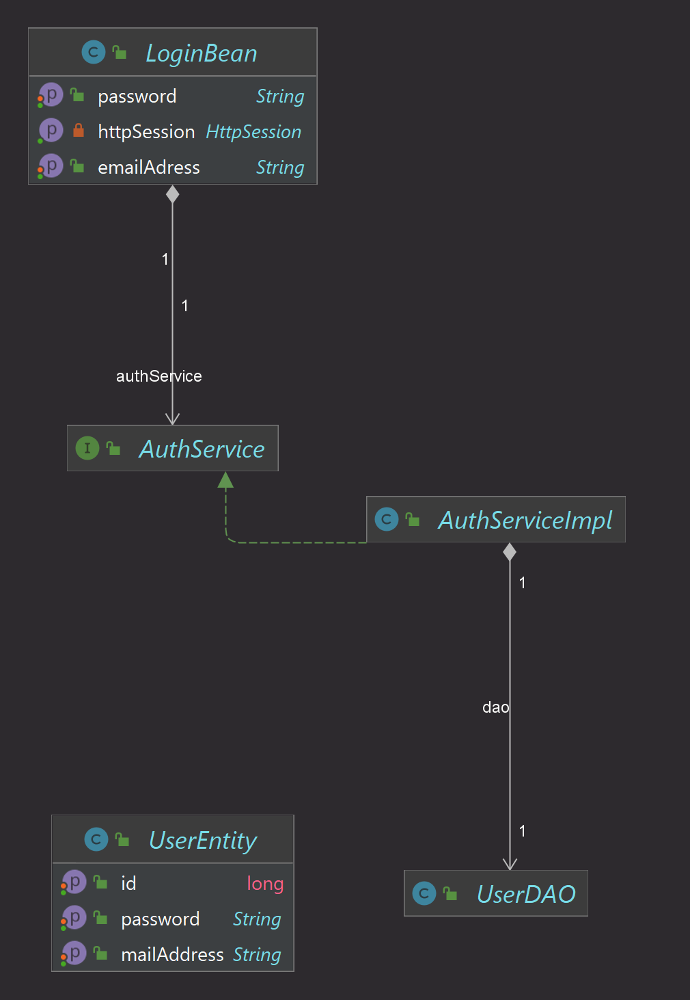

# IPWA01_FS_DK_Jakarta
Eine Website im Jakarta Server Faces Framework mit PrimeFaces und JPA.
Dieses Projekt folgt aus der Aufgabenstellung einer Fallstudie für das Modul "Programmierung von Web-Anwendungsoberflächen" (IPWA01) der IU Internationale Hochschule.
Code-Kommentare werden noch eingefügt.

Im Folgenden der grobe Aufbau der 3-Schichten-Architektur:

Auf der Startseite lassen sich die angezeigten Daten in der Tabelle sortieren und nach den Ländern suchen. Außerdem kann per Klick der zeitliche Verlauf der Menge des CO2-Ausstoßes eines Landes anzeigen.

Für den Login werden Daten aus einer einfachen lokalen JPA-Datenbank abgefragt.

Im Verwaltungsbereich, der sich nur eingeloggt besuchen lässt, wird in einer weiteren Fallstudie die Möglichkeit zur Verwaltung der Daten mit einer weiteren Datenbank implementiert werden müssen.

